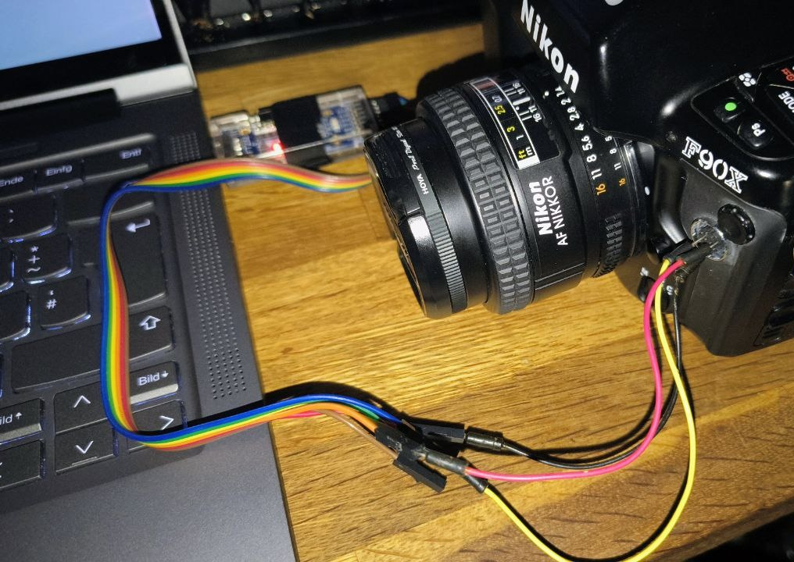

# EXIFilm - bringing EXIF data to analoge photography

## Table of Contents

- [Overview](#overview)
- [Features](#features)
- [Screenshots](#screenshots)
- [Todo](#todo)
- [Installation](#installation)
- [Usage](#usage)
- [Data cable](#data-cable)
- [License](#license)
- [Support](#support)
- [Acknowledgments](#acknowledgments)

## Overview

Digital cameras like DSLRs and smartphones are storing a wealth of information about the captured images in the form of metadata. [EXIF](https://en.wikipedia.org/wiki/Exif) (Exchangeable Image File Format) is a standard that allows these metadata to be easily shared and analyzed. EXIFilm is a Python-based tool designed to make this data accessible and useful for analoge photographers.

Some Nikon cameras from the 90s have a built-in "EXIF data memory" (called memo holder)that stores additional information about the camera's settings per captured frame, like aperture, shutter speed, ISO, and more. EXIFilm aims to extract and display this information. This information can be written to digital photos as regular EXIF data, making it easier for photographers to understand and analyze their images.

Supported cameras:

- Nikon F90(x) / N90(x) - **tested**
- Nikon F5 - *NOT TESTED*
- Nikon F100 - *NOT TESTED*

## Features

- **Download memo holder data**: Show information about stored data on camera and download it.
- **View data**: Downloaded and stored data can be viewed in a user-friendly table format.
- **Export data**: Export data to a CSV or JSON file for further analysis.
- **Import data**: Import data from CSV files.
- **Image browser**: Open files or a folder with images and view EXIF data.
- **User-Friendly Interface**: Simple and intuitive interface for seamless interaction.
- **Compatibility**: Works with Windows, Linux and MacOS (untested).

## Screenshots

### Main window


### Loading roll data from camera


## Todo

- add suppor for other EXIF tags like location
- import Nikon Photo Secretary II files (*.psh)
- more intuitive way to edit EXIF data

## Installation

1. Ensure Python 3.x is installed on your system.
2. Clone the repository:

  ```bash
  git clone https://github.com/solder-soldier/EXIFilm.git
  ```

3. Navigate to the project directory:

  ```bash
  cd Nikon_F90x
  ```

4. Install dependencies:

  ```bash
  pip install -r requirements.txt
  ```

## Usage

1. Run the application:

  ```bash
  python main.py
  ```

2. If the memory holder function is disabled, which is the factory default, it can be enabled by opening the camera dialog and enabling the memory holder function. You can choose between three different modes (see below).

3. Have some fun and finish a few photo rolls.

4. Digitalize your photos.

5. Connect the camera to your computer and start EXIFilm.

6. Download the roll data and open the images.

7. Drag the corresponing frame from the EXIF data table to a file in the image browser. Images with updated EXIF data will be marked with a red frame, until you save the image.

8. Save the images and enjoy your digital photos with EXIF data!

### Storage modes

There are 3 storage modes (Credits to [antarktikali](https://github.com/antarktikali/f90x-serial-documentation/blob/trunk/f90x-serial-documentation.md)):

| Field                       | Minimum | Intermediate | Maximum |
| ---                         | ---     | ---          | ---     |
| Bytes per frame             | 2       | 4            | 6       |
| Shutter speed               | ✅      | ✅           | ✅     |
| Aperture                    | ✅      | ✅           | ✅     |
| Flash sync mode             | ❌      | ✅           | ✅     |
| Metering system             | ❌      | ✅           | ✅     |
| Exposure mode               | ❌      | ✅           | ✅     |
| Focal length                | ❌      | ✅           | ✅     |
| Exposure compensation       | ❌      | ❌           | ✅     |
| Flash exposure compensation | ❌      | ❌           | ✅     |

### Storage capacity

#### F90/N90 Storage

| Storage Mode   | Exp/Roll | Rolls |
|----------------|----------|-------|
| Minimum        | 24 / 36  | 8 / 5 |
| Intermediate   | 24 / 36  | 4 / 3 |
| All            | 24 / 36  | 3 / 2 |

#### F90X/N90s Storage

| Storage Mode   | ExpRoll | Rolls    |
|----------------|----------|----------|
| Minimum        | 24 / 36  | 143 / 99 |
| Intermediate   | 24 / 36  |  74 / 50 |
| All            | 24 / 36  |  50 / 34 |

Example: The F90x can store up to 50 rolls with 36 exposures each in intermediate mode, or 74 rolls with 24 exposures each.

## Data cable

The Nikon F5/F90/F100 are using a properity connector with 10 pins. There are Nikon MC-31 with a D-Sub 25 and MC-33 with a D-Sub 9 (RS232) connector, but they are hard to find and lack of modern interfaces.
Luckily, the interface is a 5V serial interface, which can be easily accessed with cheap USB to serial adapters, like FT232RL.

For now, I see three options:

### Option 1: Jump wires

The connector on the camera accepts common jump wires with round contacts, which can be inserted into the camera.

**!! THIS MAY DAMAGE YOUR CONNECTOR !!**




### Option 2: Modify remote shutter cable

JJC offers a remote shutter cable, like Nikon's MC-30, which has a fully populated 10-pin connector and can be modified for data transfer.


Unfornotunately, only the focusing, shutter and ground pins are connected and the connector is fully molded. To connect to correct pins, you need to meld or cut the plastic cover and solder the pins.


*Supreme handcraft skills*:


### Option 3: Modify extension cable

The last option is to use an extension cable with a 10-pin connector, like Nikon MC-21A.
JJC offers a replica, called BF2BM, which is much cheaper but hard to find (at least in EU). So I fear it is discontinued.

## License

This project is licensed under the [MIT License](LICENSE).

## Support

For issues or questions, please open an issue on the [GitHub repository](https://github.com/solder-soldier/EXIFilm/issues).

## Acknowledgments

Special thanks to contributors and the open-source community for their support.

This project is based on the work of various people, including:

- [antarktikali made a great work at documentation](https://github.com/antarktikali/f90x-serial-documentation/) of the serial protocol, the Nikon DataLink.
- [Calcite UI icons](https://github.com/esri/calcite-ui-icons/)